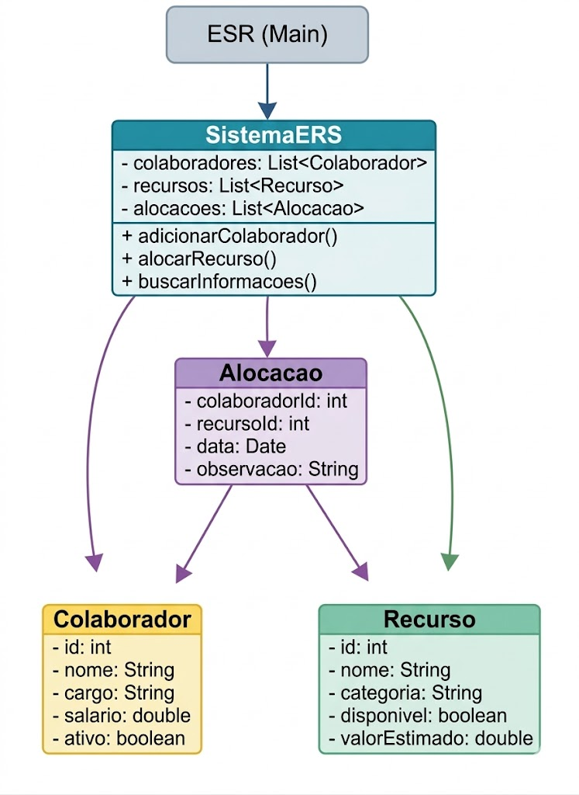

<h1 align="center"> ERS - Employee Resource System</h1>
<h3 align="center">
  Projeto desenvolvido pela <strong>NovaTech</strong>
  
</h3>
<h3 align="center">Sistema de gerenciamento de colaboradores, recursos e alocações em Java</h3>

<p align="center">
  
  
  
  
</p>
---

##  Objetivo do Projeto

O **ERS (Employee Resource System)** é um sistema desenvolvido em **Java**, com execução via **terminal**, responsável por simular o funcionamento de um sistema corporativo para:

- Cadastro e gestão de colaboradores
- Controle de recursos organizacionais
- Registro de alocações entre colaboradores e recursos
- Aplicação de regras de negócio reais
- Testes automatizados com JUnit

---

##  Estrutura do Projeto

```
CP1-Java
│
├── pom.xml
├── README.md
│
└── src
    ├── main
    │   └── java
    │       └── br/com/ers/model
    │           ├── Alocacao.java
    │           ├── Colaborador.java
    │           ├── ESR.java
    │           ├── Recurso.java
    │           └── SistemaERS.java
    │
    └── test
        └── java
            └── br/com/ers/test
                ├── AlocacaoTest.java
                ├── ColaboradorTest.java
                ├── RecursoTest.java
                └── SistemaERSTest.java
```

---

##  Arquitetura do Sistema

O sistema segue uma arquitetura orientada a objetos composta por:

- **Entidades de domínio**: Colaborador, Recurso, Alocacao
- **Classe de controle**: SistemaERS
- **Interface de execução**: ESR (main)
- **Camada de testes**: JUnit

---

##  Diagrama de Classes

<p align="center">
  
</p>

---

##  Colaborador

Representa um funcionário da empresa.

### Atributos
- id
- nome
- cargo
- salário
- ativo
- dataDeAdmissao

### Regras
- Inicia sempre ativo
- Pode ser promovido
- Pode ser desligado

---

##  Recurso

Representa um recurso organizacional (equipamento, licença, etc.)

### Regra de alocação

```
podeSerAlocado() == true
quando:
disponivel == true AND valorEstimado <= 5000
```

---

##  Alocacao

Relaciona:
- um colaborador
- um recurso
- uma data
- uma observação

---

##  SistemaERS

Classe central responsável por:
- armazenar listas de objetos
- aplicar regras de negócio
- realizar buscas
- registrar e remover alocações

---

## Execução via Terminal

O sistema possui um menu interativo:

```
1 - Gerenciar Colaboradores
2 - Gerenciar Recursos
3 - Gerenciar Alocações
4 - Sair
```

---

##  Como Executar o Projeto

### 1. Clonar

```
git clone https://github.com/seu-usuario/CP1-Java.git
cd CP1-Java
```

### 2. Compilar com Maven

```
mvn compile
```

### 3. Executar

```
mvn exec:java -Dexec.mainClass="br.com.ers.model.ESR"
```

---

##  Executar Testes

```
mvn test
```

Os testes validam:
- status inicial de colaborador
- promoções
- regras de alocação
- busca por nome

---

##  Regras de Negócio

| Regra | Descrição |
|---|---|
| Colaborador inicia ativo | ativo = true |
| Recurso caro não pode ser alocado | valor > 5000 |
| Busca por nome ignora espaços | trim + ignoreCase |
| Alocação só ocorre se recurso disponível | validação antes de registrar |

---

##  Integrantes do Grupo
| [<br><sub>Marco Aurélio </sub>](https://github.com/Arriatea) | [<br><sub>Thomas Sievers</sub>](https://github.com/Thomas-Sievers) |  [<br><sub>Matheus Vasques</sub>](https://github.com/maatvasques) | [<br><sub>Áurea Sardinha </sub>](https://github.com/ByAurea) | [<br><sub>Bernardo Hanashiro</sub>](https://github.com/BernardoYuji) | 
| :---: | :---: | :---: | :---: | :---: |
